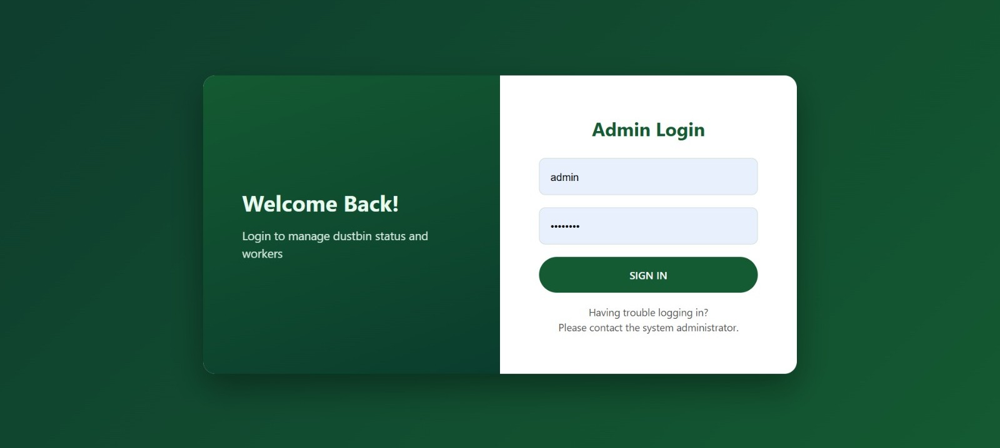
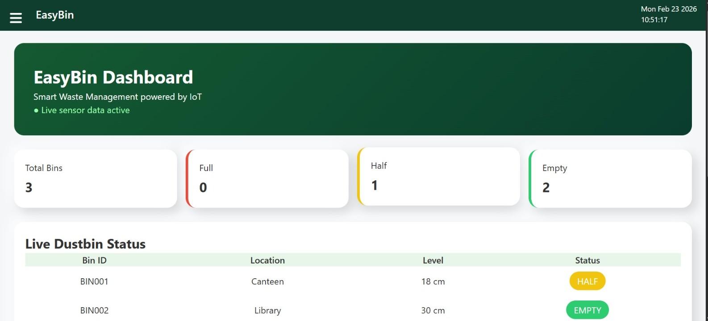
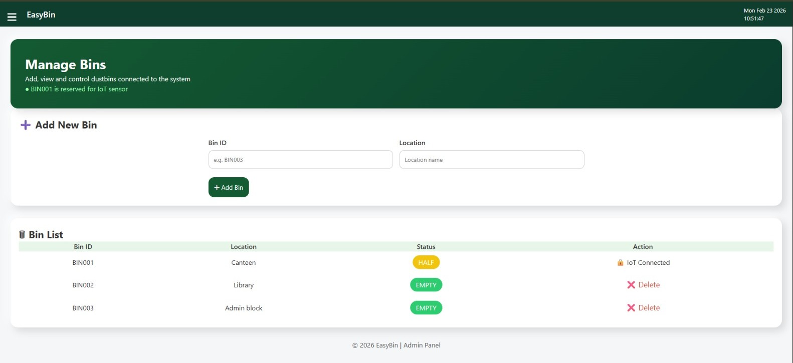
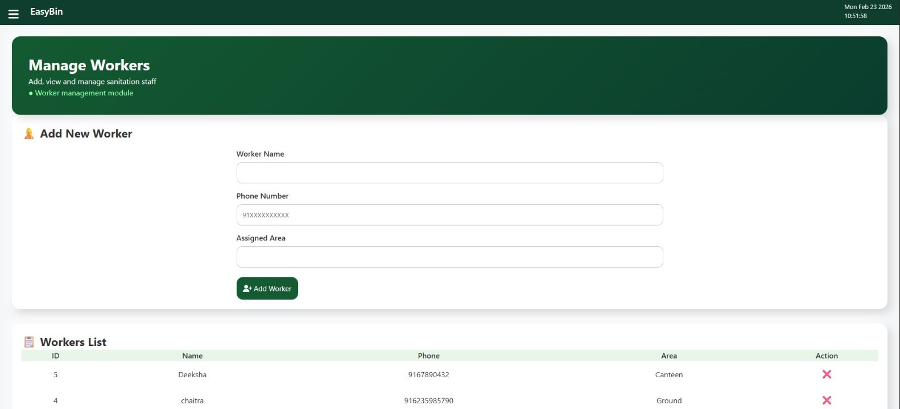
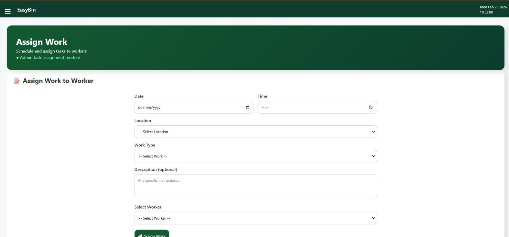
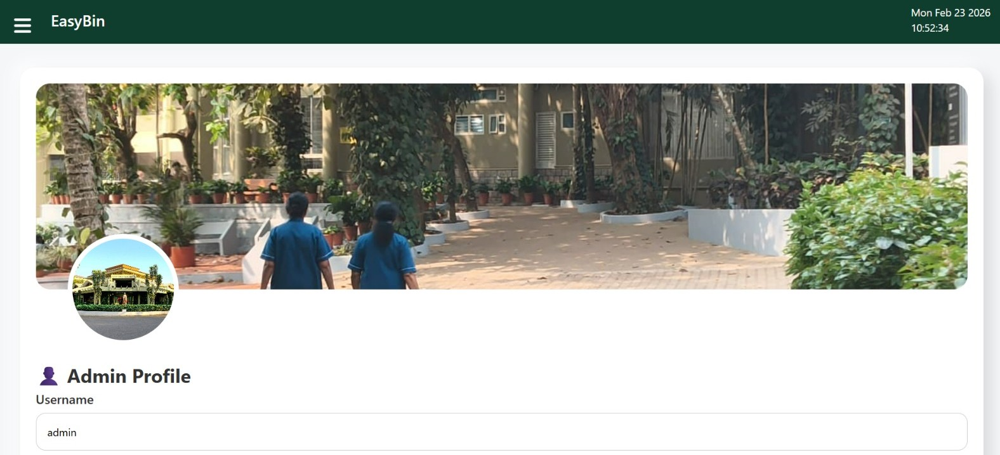
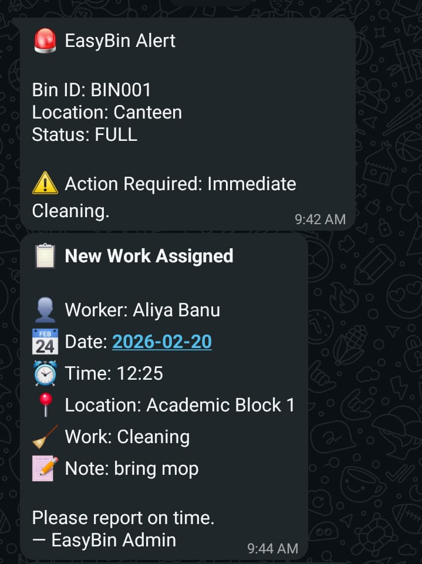

# EasyBin 🗑️  
## Smart Waste Management System using IoT  

EasyBin is a **Smart Waste Management System** developed as an **MCA Project**.  
The system integrates **IoT technology** with a **web-based management platform** to monitor
dustbin fill levels in real time and streamline waste collection operations.

The project focuses on improving cleanliness, reducing manual monitoring, and enabling
efficient task management through automation and real-time data.

---

## 🎯 Project Objectives
- To monitor dustbin fill levels using IoT sensors  
- To provide real-time bin status to administrators  
- To automate work assignment for sanitation staff  
- To send alerts when bins reach full capacity  
- To improve efficiency and accountability in waste management  

---

## 🚀 Key Features
- Secure admin authentication system  
- Real-time dustbin status monitoring  
- IoT-based ultrasonic sensor integration  
- Centralized admin dashboard  
- Worker and task management module  
- WhatsApp alert system for full bins  
- Simple and user-friendly interface  

---

## 🧠 Technologies Used

### Web Technologies
- PHP  
- MySQL  
- HTML, CSS, JavaScript  

### IoT & Cloud
- ESP8266 (NodeMCU)  
- Ultrasonic Sensor  
- ThingSpeak Cloud  
- Green API (WhatsApp Integration)  

---

## 📡 System Architecture
Ultrasonic Sensor (ESP8266)
↓
ThingSpeak Cloud
↓
Web Application (PHP)
↓
MySQL Database
↓
Admin Dashboard

## 🖥️ Screenshots

### 🔐 Admin Login

---

### 📊 Admin Dashboard

---

### 🗑️ Manage Bins

---

### 👷 Manage Workers

---

### 📝 Assign Work

---

### 👤 Admin Profile

---

### 🚨 WhatsApp Alert Message

## 📡 IoT Implementation
The IoT module uses an **ESP8266 NodeMCU** connected to an ultrasonic sensor to measure
the fill level of dustbins. Sensor data is transmitted to **ThingSpeak Cloud** using HTTP
requests.

The web application fetches the latest sensor data from ThingSpeak, updates the database,
and displays the bin status in real time on the admin dashboard.

The firmware code used for the ESP8266 is included in the `iot/` directory for reference.

---

## 🗄️ Database Design
The database schema supports real-time monitoring and management operations.

Main tables include:
- `bins` – stores dustbin details and status  
- `users` – admin authentication and profile data  
- `workers` – sanitation staff information  
- `work_assignments` – task assignment records  

The database schema is provided in `EasyBin_db.sql`.

---

## ⚙️ Setup Instructions
1. Clone the repository  
2. Import `EasyBin_db.sql` into MySQL  
3. Copy `config.example.php` and rename it to `config.php`  
4. Update database credentials and API keys in `config.php`  
5. Deploy the project on a PHP-supported server (XAMPP / InfinityFree)  

---

## 🔐 Security Considerations
- Sensitive credentials are stored in `config.php`  
- `config.php` is excluded from version control using `.gitignore`  
- User passwords are securely stored using hashing  

---

## 👩‍💻 Project Team  
*(MCA Project)*

- **Aliya Banu**  
  GitHub: [@aliya-banu](https://github.com/aliya26205)  
  LinkedIn: [Aliya Banu](https://www.linkedin.com/in/aliya-banu26/)

- **Chaithra Alva**  
  GitHub: [@chaithra_alva](https://github.com/ChaithraAlva29)  
  LinkedIn: [Chaithra](https://www.linkedin.com/in/chaithra-alva-30608939b/)

- **Deeksha G**  
  GitHub: [@deeksha-g](https://github.com/Deeksha245)  
  LinkedIn: [Deeksha](https://www.linkedin.com/in/deeksha-naik-g/)

- **Lavisha**  
  GitHub: [@lavisha](https://github.com/lavishad)  

---

  ## 🤝 Acknowledgements

We would like to sincerely thank the following individuals for their valuable support
and guidance during the development of this project:

- **Affan (IoT Support)**  
  GitHub: [@mohd-affan](https://github.com/mohd-Affan16)  
  LinkedIn: [Mohd_Affan](https://www.linkedin.com/in/mohammed-affan-79648934a/)
  

- **Rahul (WhatsApp Integration Support)**
  GitHub: [@rahul](https://github.com/Rahhul69)    
  LinkedIn: [Rahul](https://www.linkedin.com/in/rahul-achari-255a71319/)

Their support and suggestions were helpful in strengthening specific modules of the system.

---

## 📌 Conclusion

EasyBin demonstrates how **IoT and web technologies** can be effectively combined to
create a smart and efficient waste management solution.  
The system enables real-time monitoring, reduces manual effort, and improves operational
efficiency through automation and centralized control.

This project highlights the practical application of IoT in solving real-world problems
and can be further extended for **smart campus** and **smart city** implementations.

---

## 📄 License

This project is developed for **academic purposes** as part of the **MCA curriculum**.  
All rights are reserved by the project team.